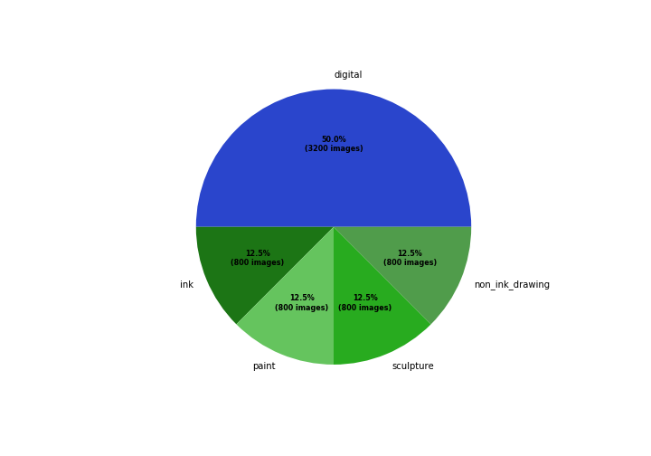

# Reddit Art Classifier

This project is designed to create a CNN classifier using images pulled from [r/Art](reddit.com/r/Art) on Reddit.

Image classification is a widely used process and a significant ammount of research and applied technologies have indicated that 
convolutional neural networks are one of the most optimal algorithms for image recognition. Convolutional neural networks have proven 
to be highly capable and extremely accurate at recognizing objects within images as well as identifying diseases and tumors in tissue 
and brain scans. This project will be something simmilar to the latter of the two in that the objects in the image are irrelevant, 
instead I'm trying to get my model to pick up on the small details in the image that would indicate the difference between a real 
brushstroke and a digital brushstroke.

This project was built primarily as a way for me to practice building large datasets by writting code to automate the process of pulling 
data from a website, attaching labels to the data, and then sorting and storing the data. The process I used to develope my dataset is 
probably the most generalizable work contained in this project, though I can see some potential applications for the model itself given 
time to train it on a large enough dataset. I think a potentially more useful approach, specifically in terms of applications aimed at 
improving the user experience on reddit, would be to build a classifier that pulls images from a multitude of different subreddits that 
could then be used to classify new images by which subreddit they should be posted to (for example an art piece would be classified 
as r/Art while a meme might get classified as r/memes). This type of classification would require a slightly different model architecture 
but the overall process developed in this project would lend itself nicely to this extrapolation.

## The Data

To gather the data used in this project, I used the [Python Reddit API Wrapper (PRAW)](https://praw.readthedocs.io/en/latest/getting_started/quick_start.html) coupled with the [PushShift API (PSAW)](https://github.com/pushshift/api). I used the APIs 
to pull batches of 1000 r/Art submissions at a time. I then parsed those submissions to find ones that had titles formatted according to 
the subreddits title standards. Additionally, I checked the properly formatted posts for upvote ratio and self-text. This additional check was 
performed to identify and remove poor quality, offensive, or deleted images. I found that posts with deleted images contained a self-text 
string equal to either *[deleted]* or *[removed]*. Similarly, I found that many of the poor quality or offensive images I had collected had 
extremely low upvote ratios typically below .4 while the average upvote ratio for the entire dataset was .92. As a result I decided not to include 
the image from any post that had an upvote ratio of less than .4 as these images were typically either such a low quality submission that they 
were not really representative of the images I was trying to classify or they were simply too offensive to be included in a project that I intended 
to use as a showcase of my skills in a proffesional setting.  

For this project I used a dataset of 6400 images, 3200 that were made using digital means, and 3200 made using other means. Only about one third 
of posts made to r/Art are created using digital means, so my code ensures that an equal number of posts is collected from each category to produce 
a balanced dataset. Taking a look at the distribution of medium types, you can see that the number of digital and non-digital images is equal, 
although there are still a total of 5 different medium classes (digital and non-digital which contains 4 classes: ink, non-ink-drawing, paint, sculpture).

## Modeling

I chose to model my dataset using a Convolusional Neural Network since CNNs typically produce good results when using a dataset comprised of images. 
When considering the architecture of my network, I thought it would be important to get the model to pick up on the small details in the images such 
as brush or pen strokes as this would be most indicative of medium. With that in mind I made two significant decisions regarding model architecture. 
The first and most effective decission was to ensure that the data generators used to feed images into the model were scaling down the image in a 
way that minimized loss of pixel level information like small scale lines and gradients. I did this by keeping the images relatively large (300x300 pixels) 
relative to many typical CNN models as well as by using [bicubic interpolation](https://www.youtube.com/watch?v=poY_nGzEEWM) which creates much smoother gradients and is better at retaining crisp lines 
compared to other interpolation methods. The second key decision I made in an attempt to target low level features was to choose tanh as the activation 
function for my first convolutional layer while using relu for the rest of my layers. The first layer of a convolutional layer is where the low level 
features are the most prominent so by using tanh as my activation in the first layer I can get my model to express even greater emphasis on differences in 
the low level features since tanh can produce negative activations while relu can only produce activation values of zero or greater.

## Model Evaluation

## Conclusion and Potential Improvements  

I could potentially improve on this model a few different ways. The first could be as simple as increasing the size of the dataset. Due to 
time constraints and the ammount of time it took to download all of the images necessary to create the dataset as well as the time it takes 
to train on larger datasets, I capped my training data at 6000 images. My code searches for posts in chronological order and the 6400 it 
collected (the additional 400 being the testing and validation sets) only dated back about a month at the oldest. Considering the subreddit 
was established in 2008, there are plenty more images available for me to concatonate to my dataset. Another potential solution would be to 
create an ensemble of CNN models that pick up on different features within the images. This could potentially increase accuracy on images that 
my current model is less certain about. Regarding my process for collecting data, using both PRAW and PSAW APIs was not entirely necessary 
for my purposes. PRAW is only necessary if you need live updates from reddit or if your application needs to make posts or comments or needs 
to use moderator commands. My use case didn't need any of these things, so just using PSAW would have likely been sufficient while also reducing
the complexity of my code in some places. Moving forward I would like to use this code as a starting point for creating a generalized dataset 
constructor that allows a user to build any kind of dataset using Reddit data given unique search and validation parameters. Considering most 
of the time spent in data science projects is gathering and cleaning data, anything I could produce that might expedite this process could 
prove to be extremely useful to both myself and others.
